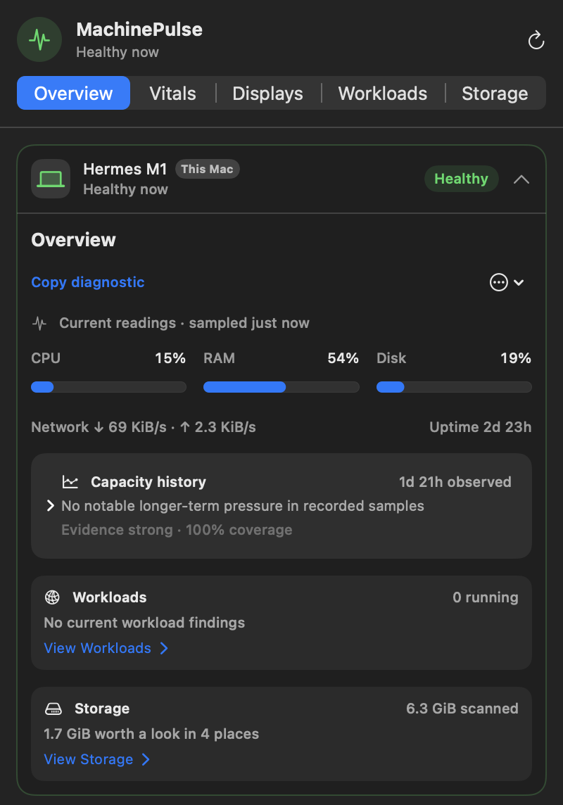
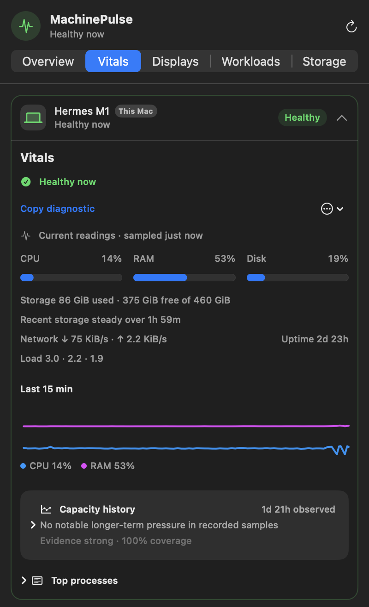
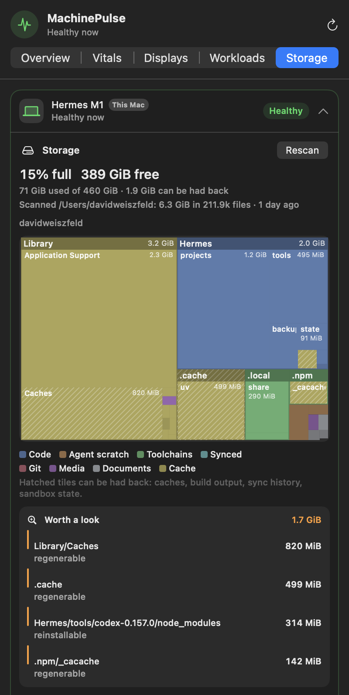

# MachinePulse



A macOS menu-bar monitor for the machines on your tailnet. It leads with the incident that needs attention, keeps the evidence behind short-lived problems, and never touches a remote machine.

MachinePulse reads what the systems you already trust expose: Tailscale for who is on the tailnet and reachable, OpenSSH for a Linux machine or another Mac, the kernel and system tools on each side. It has no agent, nothing to install on the other machines, no account, no server, and stores nothing off your Mac.

## Install

Build it yourself; there is no prebuilt app.

```sh
git clone https://github.com/weiszfelddavid/machinepulse
cd machinepulse
./scripts/install-app.sh      # ~/Applications/MachinePulse.app, ad-hoc signed
./scripts/uninstall-app.sh    # removes the app and its login item; --purge also removes data
```

- macOS 15 or later, and Swift 6.2 or later from Xcode. The Command Line Tools also work on macOS 15 and 26; on macOS 27 they lack the SwiftUI macro plugin.
- Tailscale, connected, to see the other machines. Without it MachinePulse monitors this Mac only.
- For full metrics on a remote machine: Python 3 there and an SSH key that already works without a prompt. Another Mac also needs Remote Login and the Command Line Tools.

## Use

Open MachinePulse from the menu bar, enable a discovered device, and choose **Presence** or **Full metrics**. For a Linux machine or another Mac, confirm the SSH alias MachinePulse found in `~/.ssh/config` or type a target such as `user@host`. Only enabled machines affect menu-bar health.

The panel has five projections of the same machine cards:

- **Overview** — health now, the active or just-recovered incident, current readings, and hand-offs to the sections below.
- **Vitals** — a 15-minute chart, process leaders, and up to 90 days of hourly capacity history.
- **Displays** — optional XDR Boost for this Mac's compatible displays, off by default.
- **Workloads** — project servers listening on this Mac; systemd services, listeners, and cgroup limits on a Linux machine.
- **Storage** — press **Scan** and a treemap shows where the disk space went, with reclaimable space hatched and a **Worth a look** list.

<p>


</p>

A warning needs two matching samples; a critical reading shows at once. Recovery waits for clear samples, and Linux pressure waits through a two-minute quiet window so a brief recurrence stays one incident. **Unreachable** means Tailscale reports the machine offline; a collection problem on an online machine is a separate warning that keeps the last good sample on screen. Phones and tablets that go offline stay quiet.

## What it measures

- CPU, load, memory, swap, disk capacity, and disk and network throughput
- Linux CPU, memory, and I/O pressure, with "some tasks waited" and "all tasks waited" kept apart
- Top processes, failed services, new out-of-memory kills, and an optional watchlist of expected systemd units
- cgroup-v2 limits and throttling for the services and agents that matter, judged by consequence, not configuration
- Disk composition on request: allocated size, hardlinks once, symlinks unfollowed, cloud-only folders never opened; kinds and reclaimable reasons ported from [disktree](https://github.com/tobi/disktree)

Detailed samples are kept one day, hourly capacity summaries 90 days, incidents 30 days, all in one SQLite file under `~/Library/Application Support/MachinePulse`.

## What it refuses to do

- Run anything persistent on a remote machine. The collector is streamed to `sh` over SSH, returns one JSON document, and exits.
- Read command lines, environments, file contents, or credentials anywhere.
- Delete, trash, stop, or restart anything on a remote machine. The only mutating action is a confirmed, graceful stop of a project server you own on this Mac.
- Ask for Screen Recording, Accessibility, or Input Monitoring. XDR Boost draws a uniform overlay and never reads pixels.
- Send telemetry. Diagnostics are copied to the pasteboard only when you ask, and say so before you share them.

## Develop

```sh
./scripts/verify.sh                        # build, verifier, formatter, collector syntax
swift build -Xswiftc -warnings-as-errors
swift test
```

[AGENTS.md](AGENTS.md) is the working contract: commands, house rules, invariants, and where changes belong. [docs/](docs) holds the [product behavior](docs/PRODUCT.md), [architecture](docs/ARCHITECTURE.md), [security boundary](docs/SECURITY.md), and [development](docs/DEVELOPMENT.md) notes; [CHANGELOG.md](CHANGELOG.md) lists what each version added.

Bugs and ideas go through the [issue forms](https://github.com/weiszfelddavid/machinepulse/issues/new/choose). Review a copied diagnostic before attaching it: it names devices, addresses, processes, and services. Security problems go to [private vulnerability reporting](https://github.com/weiszfelddavid/machinepulse/security/advisories/new).

## License

MIT. Third-party notices are in [THIRD-PARTY-NOTICES.md](THIRD-PARTY-NOTICES.md).

Made by [@weiszfeld](https://x.com/weiszfeld).
